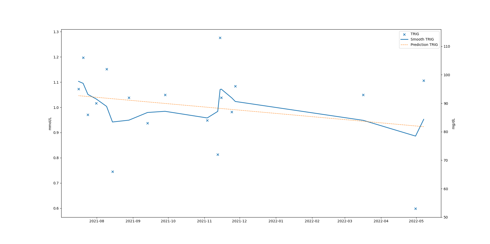
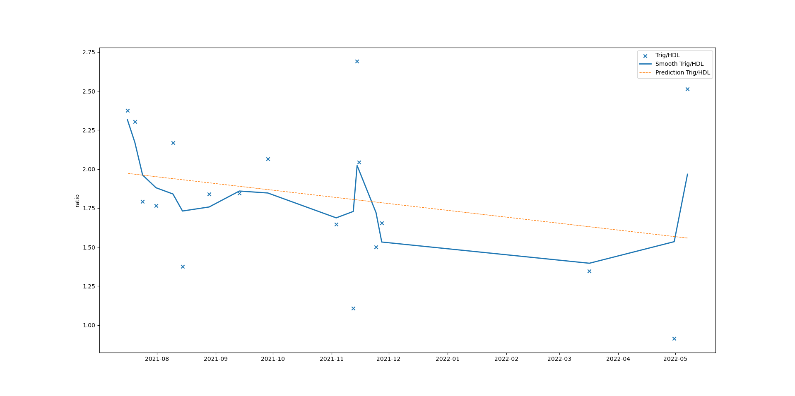

# Plots health data

I have started collecting personal health related statistics.

This repo contains scripts to visualize collected data from csv files.

Usage:

```
plotter.py [-h] [--ldl LDL] [--hdl HDL] [--chol CHOL] [--trig TRIG] [--weight WEIGHT] [--bpm BPM] [--bp SYS,DIA] [--custom CUSTOM] [--dates DATES] [--verbose]
                  csv_file

Health plotter

positional arguments:
  csv_file         CSV file with data.

options:
  -h, --help       show this help message and exit
  --ldl LDL        Column in a csv file with LDL cholesterol.
  --hdl HDL        Column in a csv file with HDL cholesterol.
  --chol CHOL      Column in a csv file with Total cholesterol.
  --trig TRIG      Column in a csv file with Triglycerides.
  --weight WEIGHT  Column in a csv file with Weight.
  --bpm BPM        Column in a csv file with BPM (heart rate).
  --bp SYS,DIA     Columns in a csv file with systolic and diastolic blood pressures.
  --custom CUSTOM  Column in a csv file with custom data to plot.
  --dates DATES    Column in a csv file with dates. 0 is a default value.
  --verbose        Print head of read file.
```

## Supported plots

Each plot consists of 3 parts:

1. Scatter plot of original data.
2. Smoothed plot over original data.
3. Linear regression fit over original data.

### Lipid panel

```
./plotter.py cholesterol.csv --hdl 1 --trig 2 --chol 3 --ldl 4  --verbose
```

The tool supports plotting of total cholesterol, low-density lipoproteins, high-density lipoproteins and triglycerides.
For example:



There are also 2 derrived ratios that you will see: LDL/HDL and Trig/HDL:



### Blood pressure

You can plot systolic and diastolic blood pressures:

```
./plotter.py bp.csv --verbose --bp 2,3
```

### Weight

To get weight plot:

```
./plotter.py bp.csv --verbose --weight 1
```

## Dates (times) column

By default the plotter assumes that column 0 contains dates. To specify different column use option `--dates`:

```
./plotter.py data/tmp.csv --bp 2,3 --dates 1
```

## Custom plot

To plot something that is not supported by the tool (or just a simple single plot), use:

```
./plotter.py data/tmp.csv --verbose --custom 3 --dates 1
```
